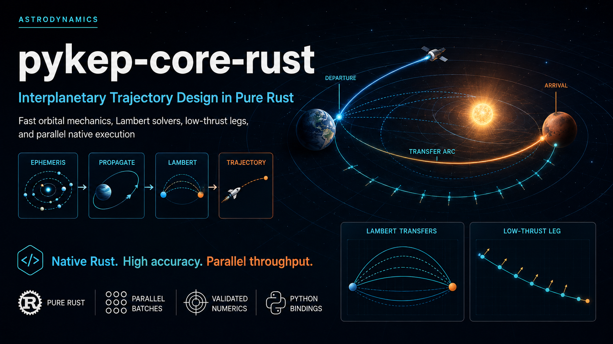

<p align="center">
  
</p>

# pykep-rust


[](https://crates.io/crates/pykep-core)
[](https://docs.rs/pykep-core)
[](https://pypi.org/project/pykep-rust/)
[](https://dietmarwo.github.io/pykep-core-rust/)

[Slides (PDF)](https://github.com/dietmarwo/pykep-core-rust/blob/main/docs/pykep-rust-slides.pdf)
· [Book (PDF)](https://github.com/dietmarwo/pykep-core-rust/blob/main/docs/pykep-rust-book.pdf)
· [YouTube video](https://youtu.be/bbxdj9rmX7M)

This repository contains an independent native Rust port of the numerical C++
library in pykep version 3 (`kep3`), together with a thin Python API built with
PyO3.

The [narrative documentation](https://dietmarwo.github.io/pykep-core-rust/)
is configured to publish from `main`. crates.io releases generate the Rust API
reference on [docs.rs](https://docs.rs/pykep-core).
For a measurement-backed choice between the original Python/C++ fcmaes/pykep
stack and the native Rust crates, see
[PERFORMANCE_GUIDE.md](PERFORMANCE_GUIDE.md).

## Implemented scope

- **Foundations:** epochs, anomalies, element conversions, two-body
  propagation, state-transition matrices, Lambert solutions, impulsive
  transfers, flybys, encodings, and MIMA approximations.
- **Ephemerides:** a common planet interface plus Keplerian, JPL
  low-precision, and feature-gated VSOP2013 providers.
- **Dynamics:** evaluated Kepler, CR3BP, bicircular, four zero-order-hold
  families, and Cartesian/equinoctial Pontryagin models with first-order
  sensitivities.
- **Integration:** adaptive Taylor is the nominal default for the TA-derived
  built-in models. General-purpose DOP853 remains available for arbitrary
  models, events, and direct variational solves.
- **Low-thrust legs:** fixed- and variable-duration Sims–Flanagan legs plus a
  generic ZOH leg for the four built-in controlled dynamics families.

Built-in Rust ZOH legs can select Taylor or DOP853 for nominal mismatch and
history evaluation. Compatibility methods, Jacobians, and the Python surface
retain DOP853. Do not infer full upstream pykep parity from this scope.

## Layout

- `crates/pykep-core`: C/C++-free Rust numerical library.
- `crates/pykep-py`: thin PyO3 extension over `pykep-core`.
- `python/pykep_rust`: typed Python package and extension stub.
- `examples`: runnable deterministic Rust examples.
- `docs`: Rust-specific design and usage documentation.
- `PERFORMANCE_GUIDE.md`: warmed-kernel measurements, pure-Rust rationale,
  and original-versus-Rust stack selection guidance.
- `ai-context.md`: operational model-selection, convention, implementation,
  and validation guidance for AI-assisted user problems.
- `docs/add-ode-system.md`: definition of done for implementing, validating,
  benchmarking, documenting, and exposing another dynamics family.
- `SECURITY.md`: supported-release and private numerical-integrity reporting
  policy.
- `tools/release-benchmark`: fixed-protocol release regression benchmark.
- `tools/taylor-benchmark`: matched-accuracy DOP853/Taylor benchmark.
- `tools/lambert-optimization-benchmark`: native KTTSP Lambert objective and
  `fcmaes-core` optimization benchmark.

## End-to-end mission tutorial

The external
[GTOC1 “Save the Earth” Rust tutorial](https://github.com/dietmarwo/fcmaes-rust/tree/main/tutorials/gtoc1)
combines `pykep-core` ephemerides, Kepler propagation, multi-revolution
Lambert arcs, gravity assists, and Sims–Flanagan low-thrust legs with
`fcmaes-core` optimization. It develops a complete fixed-sequence trajectory,
then explains multi-fidelity planet-order search, numerical validation, and
the ephemeris limitations of the resulting model score.

## Documentation map

| Topic | Guide |
|---|---|
| Upstream provenance and adaptation | [UPSTREAM_NOTICE.md](UPSTREAM_NOTICE.md) |
| Port coverage and evidence | [Source map](docs/source-map.md) and [validation](docs/validation.md) |
| Units, frames, and model contracts | [Ephemerides](docs/ephemerides.md) and [dynamics](docs/dynamics.md) |
| Integration | [Taylor](docs/taylor-integration.md) and [zero-order hold](docs/zero-order-hold.md) |
| Indirect optimal control | [Pontryagin models](docs/pontryagin.md) |
| Low-thrust transcriptions | [Sims–Flanagan](docs/low-thrust-legs.md) and [generic ZOH legs](docs/zoh-leg.md) |
| Ordered parallel computation | [Batch processing](docs/batch-processing.md) |
| Python use and migration | [Python contract](docs/python-api.md) and [upstream mapping](docs/python-migration.md) |
| Runnable examples | [Rust and Python quick starts](docs/examples.md) |
| Historical release evidence | [Pre-0.1.0 stabilization](docs/stabilization.md) |
| Publishing | [Release procedure](RELEASE.md) |

## Intended properties

- Native Rust algorithms with no C or C++ runtime dependency.
- One numerical implementation in `pykep-core`; Python wrappers contain no
  duplicate astrodynamics logic.
- Numerical parity checked against the pinned `kep3` C++ tests and generated
  reference vectors.
- Explicit units, shapes, branch ordering, error behavior, and tolerances.
- Ordered serial/parallel batches that preserve scalar numerical semantics.
- Rust and Python documentation and tests developed with each module.

## Current smoke checks

From this directory:

```bash
cargo test --workspace
cargo run -p pykep-examples --bin port-status
cargo run -p pykep-examples --bin foundations
cargo run -p pykep-examples --bin epoch-anomalies
cargo run -p pykep-examples --bin elements
cargo run -p pykep-examples --bin propagation
cargo run -p pykep-examples --bin lambert
cargo run -p pykep-examples --bin jpl-low-precision
cargo run -p pykep-examples --bin ephemeris-comparison
cargo run -p pykep-examples --bin gravity-assist
cargo run -p pykep-examples --bin low-thrust-legs
cargo run -p pykep-examples --bin dynamics
```

Once Maturin is installed, the Python module can be built in a virtual
environment with:

```bash
python -m pip install -e .
python -c "import pykep_rust as pk; print(pk.Epoch.from_iso('2030-01'))"
```

## Licensing

The upstream source and this adaptation are licensed under the Mozilla Public
License 2.0. See [LICENSE](LICENSE) and
[UPSTREAM_NOTICE.md](UPSTREAM_NOTICE.md).
