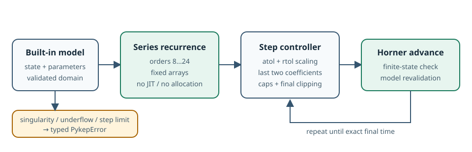
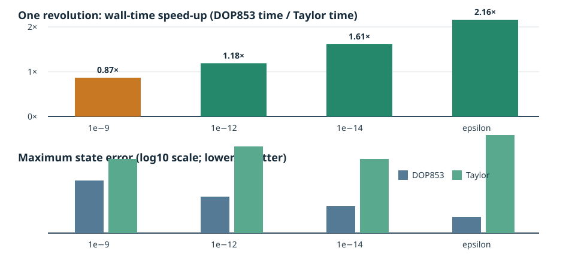

# High-accuracy Taylor integration

`pykep-core` has two pure-Rust adaptive integration backends:

- `Taylor` is the default for the eleven built-in dynamics types, matching
  upstream pykep's `ta` model families. It is most useful near `1e-14` and
  below, or when long-term invariant drift matters more than minimum
  low-accuracy wall time.
- `Dop853` accepts arbitrary `DynamicsModel` implementations, supports event
  location, and remains the general-purpose choice.

This is a focused implementation of Taylor-series integration for pykep's
fixed systems. It is not a port of heyoka's symbolic engine, LLVM compiler,
event machinery, batch mode, or arbitrary-precision support.



## What the backend computes

For a state expanded around the current time,

\\[
x(t+h)=\sum_{k=0}^{p}x_kh^k,
\\]

the model recurrence constructs coefficients through order `p`. Products use
Cauchy convolution; real powers, square roots, exponentials, sine, and cosine
use coefficient recurrences. The controller:

1. selects order 8–24 from the requested tolerance;
2. scales the final two coefficients by
   `atol + rtol * max(abs(state), 1)`;
3. chooses a conservative step from both coefficient estimates;
4. applies initial and maximum step caps;
5. clips the final step exactly to the requested time.

Backward propagation uses the same coefficients with a negative step. Every
accepted state is checked for finite values and revalidated against the model
domain. A zero or non-advancing floating-point step is reported as underflow.

The implementation follows the recurrence and step-selection ideas described
by Jorba and Zou, while being written independently for fixed Rust arrays:
[A software package for the numerical integration of ODEs by means of
high-order Taylor methods](https://eudml.org/doc/53069).

## Selecting the backend

`KeplerDynamics::propagate()`, the corresponding CR3BP and BCP convenience
methods, and `AdaptiveIntegrator::default()` select Taylor. The method can
also be stated explicitly:

```rust
use pykep_core::dynamics::KeplerDynamics;
use pykep_core::integration::{IntegrationMethod, IntegratorOptions};

let result = KeplerDynamics.propagate_with_method(
    0.0,
    [0.8, -0.2, 0.1, 0.03, 1.0, 0.02],
    0.5,
    1.0,
    IntegratorOptions {
        relative_tolerance: 1e-14,
        absolute_tolerance: 1e-14,
        ..IntegratorOptions::default()
    },
    IntegrationMethod::Taylor,
)?;
assert_eq!(result.time, 0.5);
# Ok::<(), pykep_core::PykepError>(())
```

The lower-level `Taylor` and `AdaptiveIntegrator` facades also provide final,
dense-grid, and seeded-sensitivity propagation. ZOH schedules have parallel
`*_with_method` functions.

Taylor event location is not implemented. Use
`Dop853::propagate_until_event()` when a terminal crossing is required.
Direct DOP853 propagation is also the supported path for arbitrary
third-party `DynamicsModel` implementations.

## Supported models

The nine upstream equation families produce eleven concrete Rust types:

| Family | Rust type |
|---|---|
| Cartesian Kepler | `KeplerDynamics` |
| CR3BP | `Cr3bpDynamics` |
| Bicircular problem | `BcpDynamics` |
| ZOH Cartesian Kepler | `ZohKeplerDynamics` |
| ZOH CR3BP | `ZohCr3bpDynamics` |
| ZOH equinoctial | `ZohEquinoctialDynamics` |
| ZOH solar sail | `ZohSolarSailDynamics` |
| Cartesian Pontryagin | `CartesianMassOptimal`, `CartesianTimeOptimal` |
| Equinoctial Pontryagin | `EquinoctialMassOptimal`, `EquinoctialTimeOptimal` |

Singular points stay errors. Examples include collisions, zero Pontryagin
primer norm, non-positive mass, and a zero equinoctial radial denominator.
The series backend does not smooth or silently cross these non-analytic model
boundaries.

## Measured crossover

The fixed benchmark uses the eccentric nondimensional state
`[0.5, 0, 0, 0, sqrt(3), 0]`, one revolution, release mode, and analytical
Lagrange propagation as the error reference.



| tolerance | DOP853 | Taylor | Taylor speed-up | max error, DOP853 | max error, Taylor |
|---:|---:|---:|---:|---:|---:|
| `1e-9` | 14.96 µs | 17.22 µs | 0.87× | `3.80e-8` | `1.08e-10` |
| `1e-12` | 28.62 µs | 24.17 µs | 1.18× | `9.13e-11` | `1.65e-13` |
| `1e-14` | 44.77 µs | 27.80 µs | 1.61× | `1.60e-12` | `6.84e-14` |
| machine epsilon | 71.31 µs | 33.03 µs | 2.16× | `8.39e-14` | `1.25e-15` |

These are measurements on one development host, not portable promises. The
100- and 1,000-revolution rows and all raw counters are in
[`data/taylor-kepler-benchmark.csv`](data/taylor-kepler-benchmark.csv).
Taylor coefficient sweeps and DOP853 RHS calls are different work units, so
wall time at matched accuracy—not the work-counter ratio—is the meaningful
comparison.

Reproduce the data with:

```bash
cargo run --release -p pykep-taylor-benchmark \
  > docs/data/taylor-kepler-benchmark.csv
```

## Sensitivities and validation boundaries

`Taylor::propagate_with_sensitivities()` currently uses centered differences
of complete Taylor propagations, one plus/minus pair per seed direction. This
is deterministic and matches the direct DOP853 variational result and heyoka
Kepler STM within the declared `3e-7` test tolerance, but its cost grows as
`2W + 1` propagations. For a wide STM, DOP853's directly integrated
variational equations are normally cheaper. The STM and ZOH sensitivity
convenience methods retain DOP853 as their default for this reason; request
Taylor explicitly when algorithm-family parity is more important than cost.

Validation has three independent layers:

- closed-form tests for series products, real powers, trigonometric functions,
  exponentials, and square roots;
- fixed DOP853 comparisons for all eleven concrete dynamics types, including
  all four Pontryagin variants;
- a development-only official-heyoka harness for Kepler, CR3BP, BCP, and a
  Kepler STM.

The heyoka fixture records version `7.10.1` and is regenerated with
`tools/heyoka-cross-validation/generate.py`. It is intentionally not a normal
CI dependency. The larger ZOH and Pontryagin families use the existing pinned
upstream pykep fixtures plus DOP853 comparisons; they are not presented as
direct heyoka cross-checks.

## Why no LLVM or new crate?

The equations are already fixed and hand-written in `pykep-core`. A symbolic
JIT would add compilation latency and a large dependency surface without
changing the set of systems this crate needs. Keeping the series engine
private also avoids publishing an extension trait before it has a real
external consumer.

If another project later needs the arithmetic and the internal model contract
survives unchanged, the module can be extracted into a workspace crate. That
is an API and release decision, not a prerequisite for using Taylor today.
